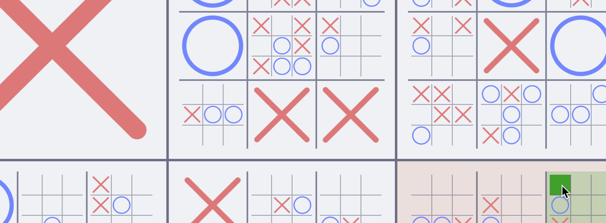
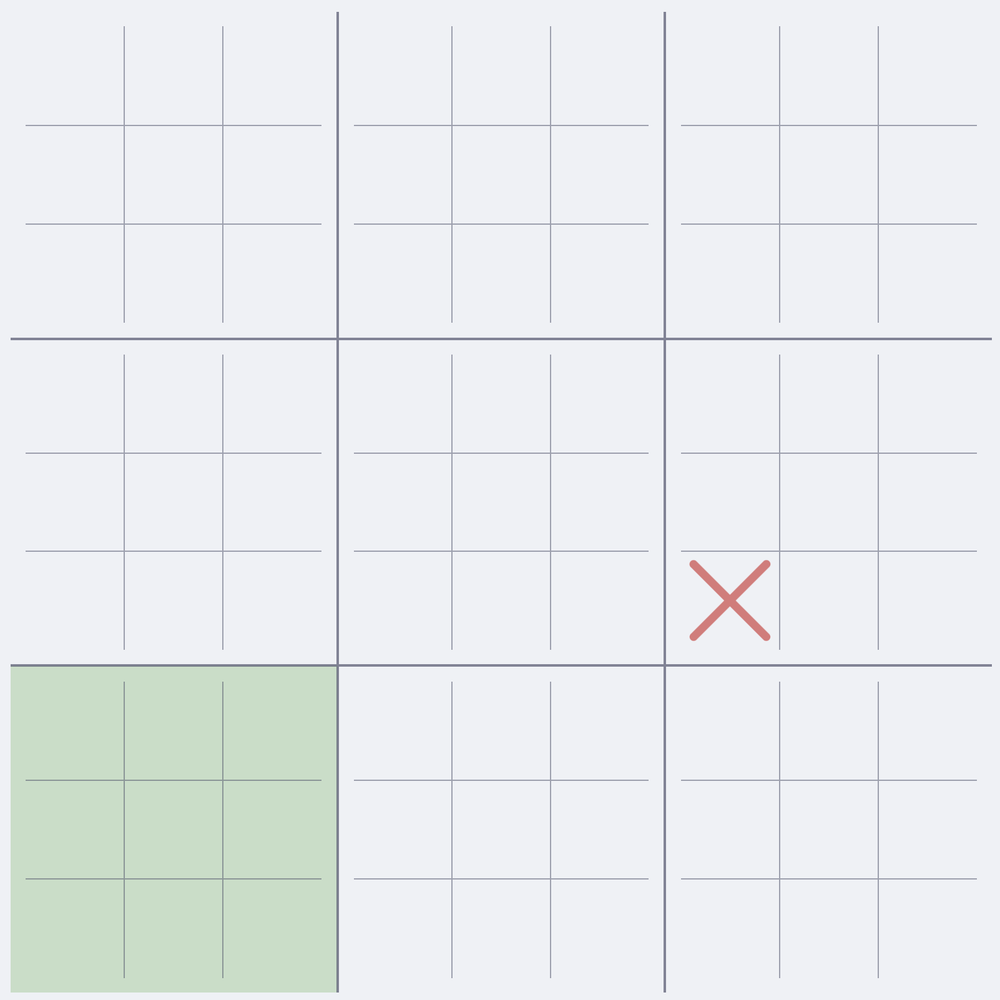
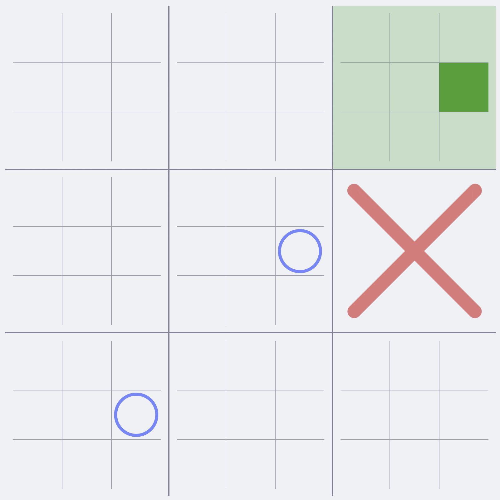
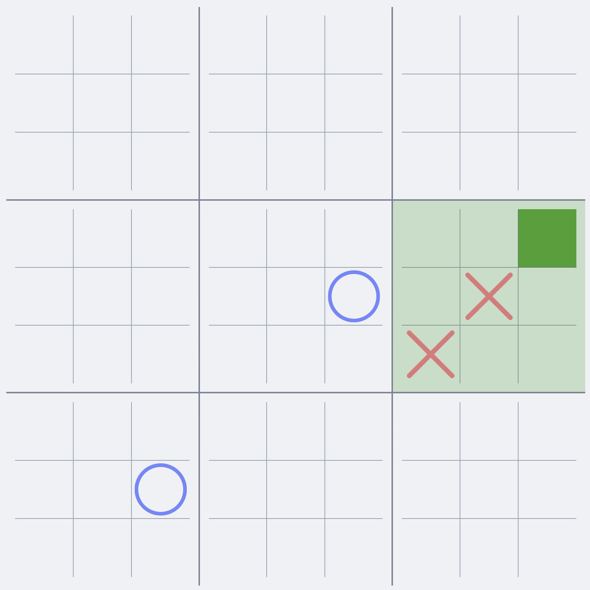

# Ultimate Tic-Tac-Toe

<picture>
    <source media="(prefers-color-scheme: dark)" srcset="client/assets/preview-dark.png">
    <source media="(prefers-color-scheme: light)" srcset="client/assets/preview-light.png">
    
</picture>

This is a node.js based server that serves an arbitrary-depth tic-tac-toe game to a browser client.

The most common Tic-Tac-Toe variant, a 2-layer "Ultimate Tic-Tac-Toe", is a game with simple rules that enable complex
gameplay — and gameplay closer to Chess than it does to normal Tic-Tac-Toe. Versions with more layers are playable in
the same fashion, but can get more tedious than they are fun. I created this because I hadn't seen a web version for
deeper than 2 layers, and it gets hard to keep track of where to play next
when [playing it on a whiteboard](client/assets/whiteboard.jpeg)!

# Installation and Running

- Ensure you have [Node.js](https://nodejs.org/) installed on your machine!
- Clone the repo and navigate to its directory
- Run `npm install`
- Run `npm start`
- Open `http://localhost:3000` in your browser
- To play with another device on the same network, find the local IP of the machine running the server and connect to it
  on port 3000. (It should look something like `http://XXX.XXX.XXX.XXX:3000` in your browser)

# How to Play

Ultimate Tic-Tac-Toe is relatively simple. You draw a Tic-Tac-Toe board, and draw another Tic-Tac-Toe board in each of
the cells! And, just like in normal Tic-Tac-Toe, your goal is to get a 3-in-a-row.

Each player can only directly place into the smallest level cells, and earn the higher-level boards by winning them!
Easy, right?

But there is one catch! When you make a move, your opponent is sent to another board relatively to where you placed your
piece.

In the example below, X played her first move in the bottom-left of a mini-board. O's next turn is then restricted to
only being within the bottom-left board!

<picture>
    <source media="(prefers-color-scheme: dark)" srcset="client/assets/tutorial-1-dark.png">
    <source media="(prefers-color-scheme: light)" srcset="client/assets/tutorial-1-light.png">
    
</picture>

This means that the most important aspect of your turn might not be where your piece goes, but where your opponent can
go next!

One thing to note for Ultimate Tic-Tac-Toe, sending your opponent to a board that's already been claimed lets them go
anywhere in the next level above that board! This makes games end much faster than they start, as it gets harder and
harder to avoid giving your opponent the opportunity to go anywhere they'd like!

<picture>
    <source media="(prefers-color-scheme: dark)" srcset="client/assets/tutorial-2-dark.gif">
    <source media="(prefers-color-scheme: light)" srcset="client/assets/tutorial-2-light.gif">
    
</picture>

## Ultimate ULTIMATE Tic-Tac-Toe

If you want to play Ultimate Ultimate Tic-Tac-Toe, there's one more thing to note! Winning a mini-board does exactly
what happens in UTTT: your opponent is sent to that board. But, because there's more than 2 layers here, they get sent
to the mini-board relative to the *cell* you played to get the win as well!

The gif below begins zoomed in on the top-centre board before X has her turn. When she wins the small **right-centre**
board by placing her piece in the **top-right** cell, we zoom out to the rest of the board.

Her opponent must then play in the **right-centre** UTTT board, in the **top-right** TTT board. Play would then continue
in the right-centre board until another board is won.

<picture>
    <source media="(prefers-color-scheme: dark)" srcset="client/assets/tutorial-3-dark.gif">
    <source media="(prefers-color-scheme: light)" srcset="client/assets/tutorial-3-light.gif">
    
</picture>
